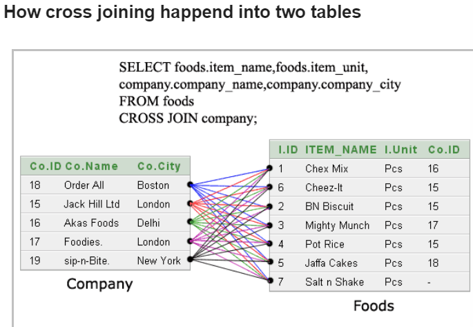
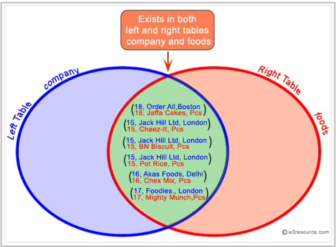
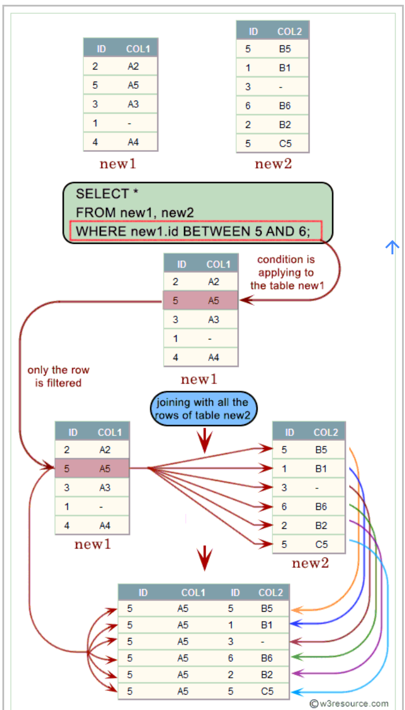

## MySQL JOIN

1. `CROSS JOIN`

   - ```mysql
     SELECT * 
     FROM table1 
     CROSS JOIN table2;
     ```

   - `Standard SQL` 에서는

     - WHERE절이 없을 때, Cross Join은 카티션 곱의 결과와 같다.
     - 테이블 A와 테이블 B를 카티션 곱할 때의 결과는 A의 모든행과 B의 모든행으로 조합할 수 있는 모든 행을 결과로 출력한다. (즉, 전체 행의 개수 = (테이블 A의 행의 개수) X (테이블 B의 행의 개수)) 수학적으로는, (테이블A의 행, 테이블B의 행)순열이라는 표현이 더 어울리겠다.

   - `MySQL`에서는 `CROSS JOIN`은 `JOIN`, `INNER JOIN`과 동일한 의미를 가지고, Standard SQL에서 의미하는 `INNER JOIN`처럼 작용한다. (고로, 서로 대체되어 사용될 수 있다.)

   - 

     <br>

2. `INNER JOIN`

   - ```mysql
     SELECT * 
     FROM table1
     JOIN table2 
     ON table1.column_name = table2.column_name; 
     ```

   - 2개의 테이블을 Join (합칠 때,) `ON` 절 뒤에 오는 조건에 부합하는 행(column)들만 결과행에 포함하는 JOIN 형태이다.

   - 만약, `table1의 특정 행의 column_name값`과 `일치하는 column_name값을 가지는 행`이 `table2`에 없다면, 해당 행은 결과 행에 포함되지 않는다.

   - 역으로, `table2의 특정 행의 column_name값`과 `일치하는 column_name값을 가지는 행`이 `table1`에 없다면, 해당 행은 결과 행에 포함되지 않는다.

   - `MySQL` 에서는 `ON` 절과 비슷한 의미를 하는 `USING` 절을 제공하고, 사용법은 다음과 같다.

   - ```mysql
     SELECT * 
     FROM table1
     JOIN table2 
     USING column_name
     ```

   - 하지만, `Standard SQL` 문법이 아니기 때문에 되도록 이식성을 위해 사용을 자제하는 것이 좋다.

   - 

     <br>

3. `OUTER JOIN`

   - ```mysql
     SELECT *
     FROM table1
     LEFT OUTER JOIN table2
     ON table1.t2_id = table2.id
     ```

   - `LEFT OUTER JOIN`은 기본적으로, `ON` 절의 조건에 부합하는 모든 행들을 결과 행에 포함하고, 추가적으로 `ON` 절 조건의 부합하지는 않지만, `LEFT OUTER JOIN` 명령어 `왼쪽`에 나오는 `table`의 모든 행들을 결과 행에 포함한다.

   - 이와 비슷하게 `RIGHT OUTER JOIN`도 기본적으로, `ON` 절의 조건에 부합하는 모든 행들을 결과 행에 포함하고, 추가적으로 `ON` 절 조건의 부합하지는 않지만, `RIGHT OUTER JOIN` 명령어 `오른쪽`에 나오는 `table`의 모든 행들을 결과 행에 포함한다.

   - 이 때, 조건에 부합하는 `반대편 테이블` 을 찾을 수 없을 때에는 `반대편 테이블의 값`은 모두 `NULL` 값으로 채운다.

   - 집합에서 `LEFT OUTER JOIN`은 `A의 전체` 를, `RIGHT OUTER JOIN`은 `B의 전체`를 `INNER JOIN`은 `A와 B의 교집합`을 의미한다고 생각하면 이해하기 쉽다.

   - 위의 `LEFT OUTER JOIN` 명령어는 MySQL에서 `LEFT JOIN` 으로 축약가능하다.

   - ```mysql
     SELECT *
     FROM table1
     LEFT JOIN table2
     ON table1.t2_id = table2.id
     ```

   - 위의 `LEFT OUTER JOIN` 명령어는 `WHERE` 절과  `(+)` 연산을 이용하여 나타낼 수도 있다.

     ```mysql
     SELECT *
     FROM table1, table2
     WHERE table1.t2_id = table2.id(+)
     ```

   - `LEFT OUTER JOIN` 일 때, 오른쪽 테이블의 컬럼에 `(+)` 연산을 붙이는 것에 유의한다.

   - `(+)` 연산이 `MySQL Docs`에는 설명이 되어있지 않으니, 그다지 사용을 권장하지 않는 것으로 보이므로, 사용은 자제한다.

     <br>

4. `NATURAL JOIN`

   - ```mysql
     SELECT *
     FROM table1
     NATURAL JOIN table2;
     ```

   - `NATURAL JOIN` 은 `EQUI JOIN`의 종류 중 하나이다. 그렇기 때문에 `ON` 절을 사용할 수 없다.(이미 `=` 연산을 조건으로 가정하고 있으므로)

   - `NATURAL JOIN`의 결과로 연관된 테이블들에 사용된 컬럼들 중 중복된 이름을 가지는 컬럼은 제거한 결과테이블만 출력한다.

   - ```mysql
     SELECT * 
     FROM company 
     INNER JOIN foods 
     ON company.company_id = foods.company_id;
     ```

   - 위의 `INNER JOIN` 의 결과로 `company_id` 컬럼이 중복되는 결과테이블을 출력한다.

   - ```mysql
     SELECT * 
     FROM company
     NATURAL JOIN foods;
     ```

   - 반면, `NATURAL JOIN`의 결과는 `company_id` 컬럼을 한번만 출력한다.

     <br>

5. `SELF JOIN`

   - ```mysql
     SELECT a.dname AS "부서명", b.dname AS "상위부서명"
     FROM department AS a
     INNER JOIN department AS b
     ON a.dcode = b.pdept
     ```

   - `SELF JOIN`은 말 그대로, 자기 자신을 JOIN하는 JOIN 형태이다.

   - 하나의 테이블을 참조하지만, 두 테이블의 컬럼명을 구분하기 위해서 위와 같은 형태를 가진다.

     <br>

6. `EQUI JOIN` , `NON EQUI JOIN`

   - `ON` 절 뒤에 들어오는 연산이 `=` 인지 아닌지에 따라 구분한다.
   - `EQUI JOIN` 이나 `EQUI JOIN`이나 모두 조건에 맞는 테이블이 많다면, 카티션 곱 연산을 이용하여 결과행의 개수가 많아진다는 점에 유의한다.
   - 

<br>

참조문서

- [MySQL 8.0 Docs JOIN Clause](https://dev.mysql.com/doc/refman/8.0/en/join.html)
- [w3resource SQL JOINING](https://www.w3resource.com/sql/joins/sql-joins.php)